# 全屋視覺記憶系統架構

- 狀態：`DRAFT ROADMAP — B1/B2 ONLY; NOT ADOPTED / NOT IMPLEMENTED / NOT VERIFIED`
- 原始日期：2026-08-23
- 範圍整理：2026-08-24
- 適用範圍：五人、三天黑客松的 recorded-perception 與未來 controlled-live roadmap；Windows + RTX 4070 筆電

> Scope notice：這是保留作設計脈絡的較廣舊提案，不是 B0 的 implementation／acceptance specification。B0 以 `docs/minimal-viable-architecture.md` 與 `PROJECT_STATE.md` 的 current direction 為準。Live sensing 仍屬未授權的 B2；SQLite 對 B0 deferred；`OPERATE` 維持 `DISABLED`。本文遺留的 `fact`、`semantic event`、`current state` 用語不得被解讀為物理真相，canonical 語意是 `ClaimCandidate -> AcceptedClaim -> StateEstimate -> AnswerTrace`。

這個 phase 分類不採納或 supersede 本文件或任何 ADR。文中的未來式設計只有在對應 gate、authority 與 ADR 另行成立後才可成為要求。

## Roadmap 一句話提案

本 B1/B2 roadmap 提議採用「模組化單體（modular monolith）＋精簡 Ports and Adapters＋可追溯 claim history」。B1 先處理 recorded replay；只有另行授權的 B2 才評估 live source。若 persistence trigger 與 ADR 0002 日後成立，再用 SQLite 保存 accepted-claim audit 與可重建的 state estimate；不預設微服務、網路 broker、圖資料庫或完整 Event Sourcing。

這不是把長期願景縮成單純的「找鑰匙」。長期產品仍可理解更多家庭事件；只是黑客松必須先用一條完整、可驗證的 vertical slice 證明核心能力：看見物件關係變化、保存時間與證據、沿關係鏈回答問題。

## 背景與限制

- 團隊有五人，但只有三天；清楚的合約可讓大家平行工作，分散式部署則只會增加協調成本。
- 一開始只有一台固定攝影機，未來希望增加多台。
- 小物件、遮擋、容器關係與長時間資源使用，比一般單張物件辨識更困難。
- detector、tracker、切片法、VLM 與儲存方法都可能快速更換，不能讓任何單一模型的資料型別污染整個程式。
- 家庭影像與事件 metadata 都敏感；隱私不是展示後才補的功能。
- 台大作業 2 的空拍小物件資料可協助預篩選方法，但與室內固定攝影機存在 domain gap。

## 目標與非目標

### B1/B2 roadmap 目標

- B1 recorded replay 轉成與 B0 相同的 canonical claim-candidate contract；未來 B2 live source 若獲授權也必須維持下游語意，但不需在 B0/B1 composition 中存在。
- 偵測／追蹤候選物件與互動，形成帶時間、信心、來源及證據的 typed `ClaimCandidate`，再由 deterministic boundary 產生 `AcceptedClaim`。
- 保存 `inside`、`at_zone`、`on`、`held_by` 等有時間有效區間的關係。
- 支援「鑰匙先放入包包，包包後來移到沙發」的關係推理與可解釋回答。
- B0 scripted regression 不依賴攝影機、GPU、雲端 VLM 或資料庫；B1 另以本機錄影與 perception adapter 加測。
- 量測品質、延遲、VRAM、丟幀與 abstention，而不是只展示成功案例。

### 三天內的非目標

- 全屋多鏡頭 re-identification、全域時間同步或中央 GPU scheduler。
- 人臉辨識、人物身分辨識、聲音錄製或全天原始影片保存。
- 微服務、Kafka/RabbitMQ、Kubernetes、Neo4j、向量資料庫或完整 CQRS/Event Sourcing。
- 動態插件探索、完整 DI framework、DVC/MLflow/OTel backend 的正式部署。
- 自製通用 Agent framework、帳號權限、多租戶與雲端正式上線。
- 同時整合所有可能的 detector、SAHI、VLM 與多種 tracker；替換點先留好，模型逐一驗證。

## 品質屬性與可驗收情境

「快速、穩定、可維護」必須轉成可測的情境。數字門檻在第一次固定硬體 benchmark 後填入，不先捏造即時性承諾。

| 屬性 | 可驗收情境 | MVP 驗證方式 |
|---|---|---|
| 可重播性 | 同一短片、模型與設定可重建相同語意事件，或落在明確容差內 | golden replay test |
| 可替換性 | 更換 detector adapter 時，memory、query 與 domain 不需修改 | adapter contract + domain tests |
| 可解釋性 | 每個位置回答能回傳 observed/inferred 狀態及 event/evidence chain | 端到端查詢測試 |
| 可靠性 | 同一事件重送兩次只改變狀態一次；重啟後可恢復已接受事件 | idempotency + restart test |
| 背壓 | GPU 跟不上輸入時記憶體仍有上限，丟幀可觀測，已接受事件不遺失 | bounded-queue stress test |
| 隱私 | raw stream 不落地；evidence 到期會連同衍生索引刪除 | retention/deletion test |
| 多鏡頭準備 | 增加第二個 recorded source 不需修改 domain event schema | two-source contract test（非 MVP 必做） |

## 系統資料流

```mermaid
flowchart LR
    INPUT["B1 recorded replay / future authorized B2 live source"] --> CAP["Source adapter<br/>source position + declared timestamp basis"]
    CAP --> TRIG["Trigger / sampler / ROI"]
    TRIG --> PER["Detector + tracker adapters"]
    PER --> CAND["Semantic candidate builder"]
    CAND --> VER["Rules + optional VLM verifier"]
    VER --> EVT["Accepted semantic claim<br/>not physical truth"]
    EVT --> AUDIT[("Future SQLite claim audit<br/>only if ADR 0002 adopted")]
    AUDIT --> PROJ["Relation/state projector"]
    PROJ --> STATE[("Derived state estimate / relation view")]
    STATE --> QUERY["Query service"]
    AUDIT --> QUERY
    QUERY --> UI["Agent tool / API / UI"]
    CAP -. "candidate window" .-> EVID[("Evidence store<br/>minimal + TTL")]
    VER -. "opaque references" .-> EVID
    EVID -. "explanation evidence" .-> QUERY
```



重要區分：

- `FramePacket` 是短命、可丟棄的傳輸資料；B1 recorded batch 可逐筆處理，只有未來 streaming profile 才需要 bounded queue 或 ring buffer。
- `AnalysisRequest` 表示「請分析這段 evidence window」的本機 compute request，不是 runtime `ActionIntent`，也不構成 generic command bus。
- `ObjectPutIntoContainer`、`ObjectTakenOut`、`ContainerMovedToZone` 只能表示系統在特定來源、規則與 scope 下接受的 semantic claim；不能只因 schema validation 就宣稱是已發生的物理事實。
- 不把每一幀當 durable event，也不把整段影像塞進事件；事件只保存 evidence reference 與 hash。

## 模組邊界與依賴方向

採 Hexagonal Architecture 的最小實用版本。執行流程可以向外呼叫，但原始碼依賴必須朝穩定抽象與 domain 內縮。

| 模組 | 主要責任 | 明確禁止 |
|---|---|---|
| `domain` | entity、relation、semantic event、時間有效性、不變條件 | import CV/LLM/UI/ORM/storage framework |
| `ports` | `VideoSource`、`Detector`、`Tracker`、`EventVerifier`、`MemoryStore` 等穩定協定 | 放入第三方模型原生型別 |
| `application` | ingest、candidate 驗證、記憶提交、projection、查詢 use case | 選擇具體 YOLO/VLM/SQLite 實作 |
| `adapters` | OpenCV、detector、tracker、VLM、SQLite、evidence filesystem 的轉接 | 繞過 use case 直接改 domain 狀態 |
| `entrypoints` | CLI、API、UI、Agent tools 的輸入輸出 | 實作位置推理或直接查寫 DB |
| `bootstrap` | 讀取並驗證設定、建立資源、選擇 adapter、啟停生命週期 | 領域邏輯 |
| `evals` / `experiments` | frozen manifests、離線評估、可公開資料的方法預篩選 | 被 production pipeline 直接 import |

依賴規則：

```text
entrypoints  -> application -> domain
                        \----> ports -> domain
adapters --------------------> ports + domain
bootstrap   -> entrypoints + application + adapters
```

- `domain` 只使用標準資料概念，不知道 OpenCV、Torch、YOLO、FastAPI 或 SQLite。
- `application` 只看到 ports 與 canonical types。
- adapter 將 tensor、YOLO result、provider JSON、資料庫 row 轉成 canonical types。
- 只有 composition root 知道具體 adapter；跨模組只走 public contract，依賴不得形成 cycle。
- Agent 只能呼叫 `find_object`、`explain_location`、`recent_events` 等 use case，不得自己查 DB 或把自由文字寫成記憶。

## 建議的初始目錄

這是邊界設計，不表示第一天必須建立每個空檔案。只有產生真正程式時才建立相應模組，避免空架構與過度分檔。

```text
hackathon/
├─ AGENTS.md
├─ README.md
├─ pyproject.toml
├─ <one lockfile>
├─ .env.example
├─ configs/
│  ├─ demo.toml
│  └─ replay.toml
├─ src/home_memory/
│  ├─ domain/
│  │  ├─ entities.py
│  │  ├─ events.py
│  │  └─ relations.py
│  ├─ ports/
│  │  ├─ video.py
│  │  ├─ perception.py
│  │  ├─ verification.py
│  │  └─ memory.py
│  ├─ application/
│  │  ├─ ingest.py
│  │  ├─ remember.py
│  │  ├─ projection.py
│  │  └─ query.py
│  ├─ adapters/
│  │  ├─ video/
│  │  ├─ perception/
│  │  ├─ verification/
│  │  ├─ storage/
│  │  └─ telemetry/
│  ├─ entrypoints/
│  │  ├─ cli.py
│  │  └─ api.py
│  └─ bootstrap.py
├─ tests/
│  ├─ unit/
│  ├─ contract/
│  ├─ integration/
│  ├─ replay/
│  └─ fixtures/
├─ evals/
│  └─ manifests/
├─ experiments/
│  └─ <bounded-study>/
├─ models/README.md
├─ var/                 # DB/evidence/runtime files; ignored by Git
└─ docs/adr/
```

`src/` layout可避免測試意外 import repository root 中未安裝的程式。任何 notebook、權重與一次性研究 code 都應隔離在明確命名的實驗目錄；只有完成來源／授權審查、經室內資料驗證且可重用的做法，才整理成正式 adapter。

## Canonical contracts

實作初期可用 immutable dataclass 與 `typing.Protocol`，不需要 ABC 繼承樹或 DI framework。至少先穩定以下概念：

> B0 不使用下列 camera/storage-oriented contract 清單；其最小 contract 定義於 `docs/minimal-viable-architecture.md`。以下只保留作 B1/B2 roadmap 候選，不能據此預建 live adapter、generic `MemoryStore` 或 SQLite dependency。

- `Frame`：`camera_id`、`camera_session_id`、source sequence、timezone-aware UTC capture time、source video time、frame dimensions/image。
- `Detection`：原圖座標系的 `bbox_xyxy`、label、confidence；任何切片座標必須先映回原圖。
- `Track`：camera/session-scoped track ID、bbox、label、confidence；不得冒充 persistent entity ID。
- `EventCandidate`：待驗證的關係變化、parent observations、evidence window、分階段 confidence。
- `AcceptedClaim`（本文舊稱 `SemanticEvent`）：通過 schema/invariant 的 immutable accepted record 或 correction；不代表物理真相。
- `LocationTrace`：答案、有效時間、epistemic status、relation path、confidence、event/evidence references。

建議 ports：

```python
class VideoSource(Protocol):
    def frames(self) -> Iterator[Frame]: ...
    def close(self) -> None: ...

class Detector(Protocol):
    def detect(self, frame: Frame, rois: Sequence[BBox]) -> Sequence[Detection]: ...

class Tracker(Protocol):
    def update(self, frame: Frame, detections: Sequence[Detection]) -> Sequence[Track]: ...

class EventVerifier(Protocol):
    def verify(self, candidate: EventCandidate) -> VerificationResult: ...

class MemoryStore(Protocol):
    def append(self, events: Sequence[SemanticEvent]) -> None: ...
    def timeline(self, entity_id: str) -> Sequence[SemanticEvent]: ...
    def locate(self, entity_id: str, at: datetime | None = None) -> LocationTrace | None: ...
```

這些 signature 是歷史設計方向，不是目前 public contract。B0 只實作窄的 replay、claim commit 與 scoped query 邊界；只有具體第二實作或 persistence trigger 成立後，才從這些候選中提出新 contract。不要為了介面看起來完整而提早建立 background worker、generic memory API 或複雜 async pipeline。

## 識別與時間語意

- `camera_id`：穩定但去識別化的來源 ID；對應房間/zone 的校準資料不能硬編碼。
- `camera_session_id`：每次 capture 啟動建立；tracker ID 只在此 scope 有效。
- `source_sequence`：同一 camera session 內單調遞增，用於排序與去重。
- `track_id`：短期視覺軌跡；不能直接等同 `entity_id`。
- `entity_id`：記憶層的長期物件概念；其解析策略與不確定性必須獨立於 tracker。
- `occurred_at`：畫面中事件發生時間；UTC/RFC 3339。
- `ingested_at`：系統接受事件時間；可與 `occurred_at` 不同。
- 多來源不假設存在可靠全域順序；第一版只保證同一 camera/session 的 sequence。

## 語意事件 envelope

採 CloudEvents 思路的精簡子集，保留未來換 transport 的能力，但不需要導入 CloudEvents SDK。

```json
{
  "specversion": "1.0",
  "id": "018f...",
  "source": "urn:home-memory:camera:cam-7f3a",
  "type": "home.relation.asserted.v1",
  "schema_version": 1,
  "time": "2026-08-23T08:15:30.123Z",
  "dataschema": "schema://home-memory/relation/v1",
  "subject": "entity:key:01",
  "trace_id": "interaction-window-id",
  "data": {
    "ingested_at": "2026-08-23T08:15:31.002Z",
    "camera_session_id": "session-id",
    "source_sequence": 1042,
    "epistemic_status": "observed",
    "parent_event_ids": [],
    "relation_delta": {
      "operation": "assert",
      "subject_id": "entity:key:01",
      "predicate": "inside",
      "object_id": "entity:bag:01",
      "valid_from": "2026-08-23T08:15:30.123Z"
    },
    "confidence": {
      "detector": 0.82,
      "tracker": 0.91,
      "relation": 0.76,
      "policy_version": "confidence-v1"
    },
    "evidence": {
      "ref": "evidence://opaque-id",
      "sha256": "...",
      "expires_at": "2026-08-23T08:25:30.123Z"
    },
    "runtime": {
      "pipeline_version": "...",
      "model_artifacts": [],
      "config_hash": "...",
      "code_revision": "..."
    }
  }
}
```

必要規則：

- `source + id` 唯一，consumer 依此去重；同一事件重送不得重複修改 projection。
- schema 採 additive change 優先；breaking change 升 major version，並提供相容 reader 或 migration 與 replay fixture。
- `observed`、`inferred`、`user_confirmed` 不可混用。低信心可保存成 hypothesis 或直接 abstain，但不得寫成已觀察事實。
- 圖片或影片存於 evidence store；event 只保留 reference、hash、到期時間與必要 redaction metadata。
- 一般修正使用 correction/retraction event；隱私刪除是可破壞歷史完整性的明確例外。

## 關係記憶語意

核心不是讓 VLM 直接回答，而是維持可查詢、可解釋的時間關係。

```text
observed:  inside(key, bag), valid_from=t1
observed:  at_zone(bag, sofa), valid_from=t2
query:     locate(key, t>=t2)
inferred:  key -> inside bag -> bag at sofa
answer:    鑰匙最後被看見放進包包；包包後來移到沙發。
```

- 包包移動時，不替看不見的鑰匙製造虛構 `key moved` observation；位置只在 query/projection 層沿 containment 推理。
- `take_out(key, bag)` 結束 `inside` validity，也終止經包包繼承的 zone。
- 同一物件互斥的直接位置關係需要明確 close/replace 規則。
- containment graph 不允許 cycle。
- chain confidence 的合成策略及回答/abstain 門檻要版本化；第一個室內 validation set 完成後再固定數字。
- 若 evidence 已依 retention 刪除，事件可保留但查詢必須標示 evidence unavailable；若使用者要求隱私刪除，則按 policy 清除對應 event、projection、index 與 artifact。

本 B1/B2 roadmap 曾提議採用「append-oriented accepted-claim audit table＋derived-state projection」。這仍是 ADR 0002 的 deferred proposal，不是 B0 requirement，也不宣稱已實作或採用完整 Event Sourcing。

## B1/B2 roadmap：Runtime 與資源策略

- B1 的 local recorded source 將 frames/model reports 轉成 B0 canonical claim-candidate contract；未來 B2 source 只有在另行授權後才設計，且不應存在於 offline composition。
- 若 B1 實測需要，一個 process 可持有 CUDA model；背景 thread 只在量測顯示同步 pipeline 不足時再提案。
- camera、model、database、network client 在 bootstrap/lifespan 建立，不在 module import 時啟動。
- bounded queue 是未來 concurrent/streaming profile 的條件性設計，不是 B0/B1 recorded batch requirement；若導入，必須記錄 queue depth/dropped frame，且 accepted claim 不可默默遺失。
- 先用 motion/interaction trigger 或 ROI 減少推論；VLM 只檢查候選 evidence window，不連續觀看整條串流。
- PyTorch detector 同時使用 `eval()` 和 inference mode；效能與 deterministic 模式分開量測。
- 若 persistence trigger 成立且 ADR 0002 另行採納，SQLite 可採單一 writer、多 reader；在此之前不得把它當成 B0 dependency。

## 設定、依賴與 artifact lineage

- `pyproject.toml` 是套件、CLI、測試、lint/type-check 設定的單一入口；只維護一種 lockfile。
- secret、camera URL、port、裝置與本機路徑使用 environment variable；提交不含秘密的 `.env.example`。
- detector、weights、threshold、image size、tiling、prompt version、buffer、TTL 使用 checked-in typed TOML/YAML；只有 bootstrap 讀取並驗證設定。
- 啟動遇到未知欄位、缺少 artifact 或不合法值時 fail fast，不能靜默套預設。
- model/dataset manifest 至少包含來源 URI、授權、版本、內容 hash、label/schema、建立時間與用途。
- 每個 run 保存去除秘密的 resolved config、config hash、code revision/dirty flag、seed、dataset/model/lock hash、Python/PyTorch/CUDA/cuDNN/driver/GPU 資訊。
- 禁止 mutable `latest`；`champion` alias 可以存在，但 run/event 必須記錄解析後的 immutable version/hash。
- 三天內以 Git + filesystem manifest 即可。資料量與實驗數量真正增加後，再用 ADR 評估 DVC、MLflow 或外部 artifact store。

## 測試與評估

### 測試分層

| 層級 | 目的 | 代表案例 |
|---|---|---|
| Unit | 純 domain 邏輯 | relation validity、cycle、confidence、TTL、座標轉換 |
| Schema/contract | adapter 與事件邊界 | empty/invalid model output、event fixture、舊 schema reader |
| Integration | 組件合作但不依賴不穩定 GPU | B0：scripted claim fixture -> session ledger -> scoped query；SQLite 僅在 persistence ADR 採納後另測 |
| Golden replay | 真實固定短片的端到端回歸 | clip/config/model manifest -> expected event/state/answer |
| Slow/GPU eval | 比較真實模型品質與成本 | detector/tracker/VLM、latency、VRAM、dropped frames |
| Privacy/recovery | 長期可靠性 | evidence TTL、cascade delete、restart、duplicate/late event |

預設 CI/每次提交應跑 unit、schema/contract 與 scripted integration。真實 GPU 測試另標 `slow`/`gpu`，避免讓每位隊員都被硬體阻塞。

必備 golden cases：

1. `put_into(key, bag); move_to(bag, sofa)` 能解析鑰匙位置與完整 evidence chain。
2. `take_out` 正確終止 inherited location。
3. duplicate event 不重複套用。
4. late event 正確排序、重算或標示衝突。
5. containment cycle 被拒絕。
6. evidence TTL 到期不會讓 relation projection 壞掉，但回答標示證據已過期。
7. privacy deletion 清除所有受影響的 artifact/index/projection，並留下不含個資的 deletion receipt。

### 評估矩陣

| 層級 | 指標 |
|---|---|
| Detection | AP/AR、AP-small/AR-small、依 pixel size 分桶、false positives/minute |
| Tracking | track continuity、ID switches；資料足夠時加入 HOTA |
| Semantic event | macro F1、relation exact match、時間容忍窗內命中率、abstention rate |
| End-to-end | 最後位置回答正確率、evidence-chain 完整率、query latency |
| System | 每階段 p50/p95 latency、real-time factor/FPS、dropped frames、queue depth、VRAM、GPU duty cycle |

作業 2 的正確用途：

1. 凍結原作業的資料、split、baseline 與計算方式。
2. 比較 slicing、解析度、augmentation、loss 或 detector family 等小物件方法。
3. 同時報 AP-small/AR-small、operating-threshold recall、latency 與 VRAM，而非只看總 mAP。
4. 將有效候選帶到 `home_golden` 室內短片重驗。
5. 只有室內事件與端到端指標也改善，才把方法正式帶入產品 adapter。

這可回答「哪種小物件方法值得繼續」，不能直接證明「已解決家庭鑰匙偵測」。

## Observability 與失敗行為

初期輸出 OTel-compatible structured JSON log 即可，不需要架設 collector。建議關聯欄位：

```text
timestamp, level, component, operation, trace_id,
camera_id, event_id, model_name, model_version, config_hash,
latency_ms, queue_depth, confidence, decision, error_code
```

高 cardinality 的 `entity_id`、`track_id`、`event_id` 可進 log/trace，不可當 metric label。產品 SLI 應包含位置回答正確率、事件處理成功率與查詢延遲，不能只監看模型 FPS。

| 失敗 | 行為 |
|---|---|
| camera 中斷 | 明確進入 degraded 狀態、有限重試、記錄 reconnect 指標 |
| frame queue 滿 | 丟棄/合併最舊 transient frame、增加 counter，不阻塞到記憶體無限成長 |
| detector/tracker/VLM 失敗 | 不建立虛假 observed event；保留可重試狀態或 abstain，記錄 stage error |
| 低信心/遮擋 | 保存為明確 hypothesis 或不提交；查詢不得說成確定事實 |
| storage append 失敗 | 不回報事件已接受；讓 use case 可重試並保持 idempotent |
| evidence 過期 | event 標示 evidence unavailable；projection 依 retention policy 處理 |

## 隱私與 retention

- Live frames：預設只在 RAM ring buffer，程序結束即消失。
- Evidence crop/clip：預設關閉或短 TTL；只保存驗證事件所需範圍。
- Derived events/relations：可較長保存，但仍是敏感生活模式資料，TTL 與刪除入口必須明確。
- Eval clips：與家庭 runtime 資料分開，需有同意、用途、license/manifest 與存取限制。
- Cloud VLM：明確 opt-in，只上傳最小 crop/clip，記錄 provider、purpose 與 retention 假設。
- 不做臉部、人物或聲音身分辨識。攝影機要有可見運作/暫停狀態，並提供刪除證據與事件的路徑。
- retention 由用途決定，不由硬碟剩餘空間決定；刪除工作需有測試、失敗指標及不含個資的 receipt。

## 往多鏡頭演進

第一天就保存 `camera_id`、`camera_session_id`、source sequence 與 calibration reference，但不實作跨鏡 identity resolver。

- 每台 camera 有獨立 reader、ring buffer 與 sequence。
- room/zone calibration 是設定或資料，不寫死在程式。
- tracker 只負責 camera-local identity；未來 cross-camera resolver 是獨立 adapter/use case。
- 證據不足時保留「最後由 camera A 看見」，不能強行把不同 camera track 合併。
- 只有出現獨立擴縮、故障隔離或不同裝置部署需求時，才考慮抽出 GPU worker。由於 ports 與 serializable event contract 已存在，屆時不必改 domain。

## ADR 使用規則

只為會影響結構、非功能品質、依賴、介面、資料生命週期或建置方式的決策新增 ADR。每份使用 `Title / Status / Context / Decision / Consequences`，控制在一至兩頁；舊決策被替換時標記 `Superseded`，不要刪除或覆寫歷史。

目前初版：

- `docs/adr/0001-use-a-modular-monolith.md`
- `docs/adr/0002-store-semantic-events-and-project-current-state.md`
- `docs/adr/0003-prove-an-offline-read-only-baseline-first.md`

三份 ADR 目前都未採納；ADR 0002 對 B0 的 applicability 為 deferred。B0 的完整 staged proposal 與 conformance map 位於 `docs/minimal-viable-architecture.md`。

## 研究依據及如何套用

| 權威來源 | 套用到本專案的結論 |
|---|---|
| [OpenAI：AGENTS.md](https://learn.chatgpt.com/docs/agent-configuration/agents-md) | 根目錄只放短而可執行的 repo 規則；特殊模組日後使用較近的 nested instructions |
| [Microsoft：Design for evolution](https://learn.microsoft.com/en-us/azure/architecture/guide/design-principles/design-for-evolution) | 高內聚、低耦合、明確且可測的 contract，domain 與 infrastructure 分離 |
| [Microsoft：Architectural principles](https://learn.microsoft.com/en-us/dotnet/architecture/modern-web-apps-azure/architectural-principles) | separation of concerns、encapsulation、dependency inversion、explicit dependencies |
| [Google Cloud：Promote modular design](https://docs.cloud.google.com/architecture/framework/performance-optimization/promote-modular-design) | 模組可維護但也有通訊/效能成本，因此採模組化單體而非過度拆分 |
| [Alistair Cockburn：Hexagonal Architecture](https://alistair.cockburn.us/hexagonal-architecture) | camera/model/database 都透過 ports/adapters，無硬體時仍能測核心 |
| [Martin Fowler：Monolith First](https://martinfowler.com/bliki/MonolithFirst.html) | 三天內先找穩模組邊界，不承擔微服務部署與錯誤邊界成本 |
| [CloudEvents specification](https://github.com/cloudevents/spec/blob/main/cloudevents/spec.md) | 事件 envelope 的 ID、source、type、time、schema 與去重語意 |
| [Microsoft：Event Sourcing pattern](https://learn.microsoft.com/en-us/azure/architecture/patterns/event-sourcing) | 保留 audit/history 與 projection，但因 MVP 成本不採完整 Event Sourcing |
| [Google：Rules of Machine Learning](https://developers.google.com/machine-learning/guides/rules-of-ml) | 先建立可信端到端 pipeline、簡單 baseline 與 metric，再增加模型複雜度 |
| [Google：ML Test Score](https://research.google/pubs/the-ml-test-score-a-rubric-for-ml-production-readiness-and-technical-debt-reduction/) | 同時測資料、模型、pipeline 與 monitoring，不把單一 mAP 當成完成 |
| [PyTorch：Reproducibility](https://docs.pytorch.org/docs/stable/notes/randomness.html) | 固定 seed/environment 並標示 deterministic trade-off，不承諾跨平台 bitwise 重現 |
| [PyPA：src layout](https://packaging.python.org/en/latest/discussions/src-layout-vs-flat-layout/) | 正式 Python package 放 `src/`，避免測到工作目錄中的錯誤 copy |
| [pytest：Good Integration Practices](https://docs.pytest.org/en/stable/explanation/goodpractices.html) | 測試獨立於 package，使用安裝後的 code 與穩定 fixtures |
| [OpenTelemetry：Observability primer](https://opentelemetry.io/docs/concepts/observability-primer/) | 以 logs、metrics、traces 解釋未知失敗，SLI 從使用者結果而非只看資源 |
| [NIST Privacy Framework](https://www.nist.gov/privacy-framework) | 從資料收集到刪除管理完整生命週期與個人隱私風險 |
| [Michael Nygard：Documenting Architecture Decisions](https://cognitect.com/blog/2011/11/15/documenting-architecture-decisions) | 用短、可保留歷史的 ADR 記錄重要取捨，而非建立不會更新的大規格書 |

## 待下一輪決定

以下內容應在看過黑客松評分規則、現有作業 2 資料與第一輪室內錄影後決定，不在架構初版中硬猜：

- Python 與 PyTorch/CUDA 的團隊固定版本、套件管理器及 lockfile。
- 第一個 detector/tracker、是否需要 SAHI，以及 VLM 是 local 還是 cloud。
- 室內 `home_golden` 的場景、標註格式與 confidence/abstain 門檻。
- SQLite schema、evidence 預設 TTL 及刪除粒度。
- Demo UI、Agent framework 與最終展示流程。
