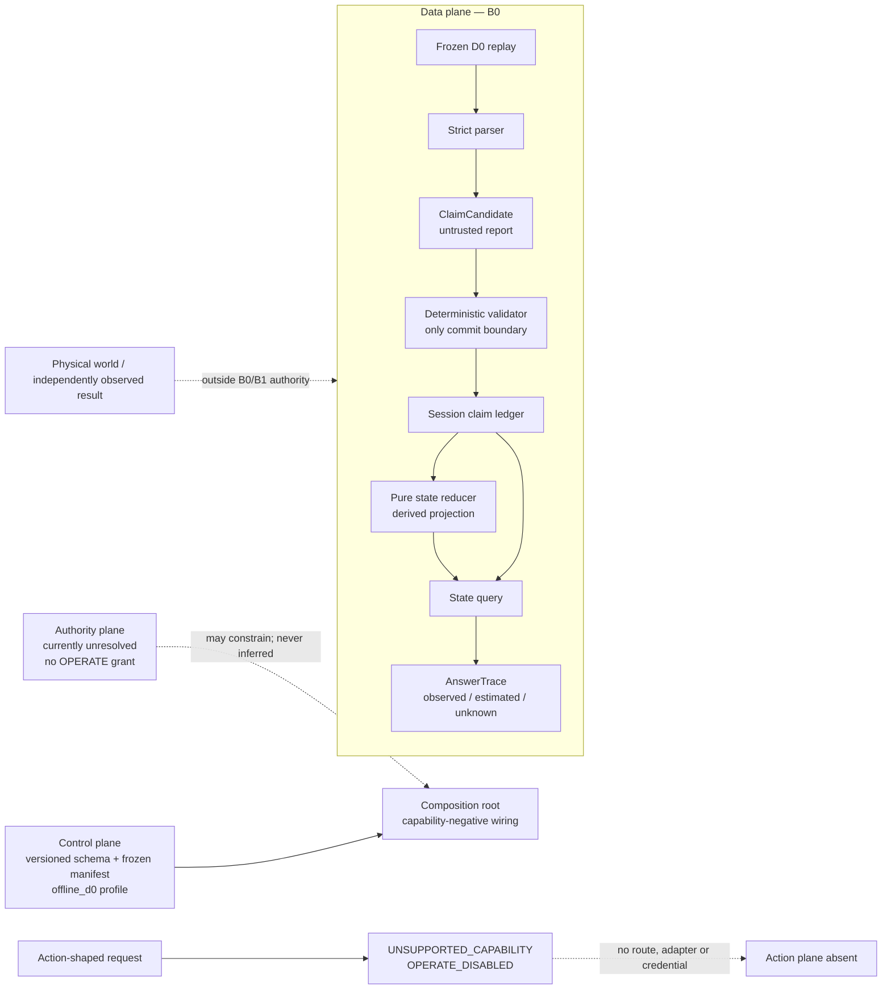
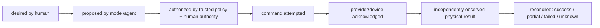

# 全屋 Agent：最小可行、唯讀且可驗證的架構提案

**狀態：** `PROPOSED — DESIGN ONLY`\
**日期：** `2026-08-24 Asia/Taipei`\
**目前模式：** `DECIDE / PROPOSAL ONLY`\
**OPERATE：** `DISABLED`\
**設計判定：** `GOOD FOR DESIGN GATE`\
**Runtime status：** `OPERATE DISABLED`

這份文件提出一個可以被反駁、逐步驗證的最小基線。它不代表架構已採納、程式已實作、模型已有效、家庭資料可被處理，或系統可連接攝影機、雲端與裝置。

> 2026-09-02 bounded extension: the user later requested cross-process demo memory,
> free-text location questions, and an optional LLM API. ADR 0023 implements these only
> for synthetic/public D0 through a completed-replay SQLite archive, deterministic
> parser, and literal-loopback presenter. This supersedes the session-only engineering
> choice for that bounded demo slice, not the B0 baseline, household-data policy, cloud
> egress prohibition, or `OPERATE DISABLED` status.

## 1. 決策摘要

第一個基線只證明一件事：給定凍結、可合法使用的離線測試輸入，系統能把「物件被放入容器，容器後來移到某區域」整理成可追溯的狀態估計，並回答它知道什麼、不知道什麼，以及答案依據哪些輸入。

最小基線採用：

- 一個本機 process、一個 application orchestrator、同步且逐筆的 replay；
- 凍結的 D0 合成／公開測試資料，不連接 live camera、RTSP、家庭資料、網路服務或真實裝置；
- typed claim candidate、決定性的驗證規則、session-local claim ledger、可重建的 state projection 與 evidence-bound query；
- 結構化答案或固定模板；自然語言模型不是成功路徑的必要元件；
- action capability 在產品入口、依賴、憑證與執行 adapter 層都不存在；任何 action-shaped request 都回覆 `UNSUPPORTED_CAPABILITY / OPERATE_DISABLED`。

最小基線**不預設**下列元件必要：

- `Memory Core`、記憶平台、向量資料庫或長期個人化；
- graph database、graph service 或通用 knowledge graph；
- multi-agent 協調、agent-to-agent protocol 或分散式 worker；
- LLM/VLM、雲端 API、message broker、microservices 或 durable database；
- action planner、action broker、device executor 或任何 safety-critical action schema。

專門化元件只能在本文件第 13 節的量測觸發條件成立後再提案。缺少證據不是導入複雜度的理由。

## 2. 最小產品主張與反證條件

### 2.1 主要使用情境

凍結輸入包含以下時間序列：

1. source sequence `1`：來源報告 `inside(key, bag)`；
2. source sequence `2`：來源報告 `at_zone(bag, sofa)`；
3. query step：查詢 `locate(key, as_of_source_sequence=2)`。

預期結構化答案：

- accepted source report：fixture 報告鑰匙在包包內，且該 claim 通過本次 schema/invariant validation；
- 衍生估計：fixture 接著報告包包位於沙發區，因此系統在該 replay scope 估計鑰匙可能隨包包位於沙發區；
- `world_scope=fixture:<id>@<revision/hash>`、`replay_run_id`、`as_of_source_sequence=2`、optional `valid_at`、`projection_frontier`、輸入 claim IDs、關係鏈與不確定性完整；
- 文字回答必須說「在這次 replay 處理到 sequence 2 時，系統估計……」，不得回答成真實世界「現在位於……」；
- 不把「推論位置」說成攝影機直接看見的事實。

### 2.2 最小成功條件

在凍結的 golden cases 上：

- 相同輸入、版本與設定產生完全相同的 canonical accepted-claim semantics、state estimate 與 structured answer；semantic equality 排除每次執行不同的 run ID、wall-clock、temporary path 與 telemetry；
- `take_out(key, bag)` 會終止繼承位置；duplicate 不會重複改變狀態；cycle、缺少 provenance、矛盾或過期輸入不會被靜默接受；
- 每個答案都能回傳來源鏈，或明確回覆 `UNKNOWN`、`CONFLICT`、`STALE`；
- replay、restart 或 query 都不可能觸發外部／實體 action。

### 2.3 立即反證或停止條件

以下任一項發生，基線即未通過：

- 無法只靠凍結輸入重現答案；
- model output 可繞過 deterministic validation，或直接改變 accepted claim/state；
- answer 把 reported、observed、estimated 混為一談；
- config、prompt、fixture 或 model output 能授予自己權限；
- 程序會開啟 camera、network、cloud client、device client 或載入 operational credential；
- action request、歷史 replay 或重啟能抵達 executor；
- command acknowledgement 被當成 physical outcome；
- 測試只驗 happy path，沒有保存 hostile、failure 與 recovery 結果。

### 2.4 與既有草案的關係

`docs/architecture.md` 現已分類為 B1/B2 roadmap；ADR 0001、ADR 0002 與 ADR 0003 仍未採納。ADR 0002 的 B0 applicability 為 deferred。本文件提出更小的第一個 acceptance slice：先以 session-local ledger 與可重播輸入證明語意，再評估 SQLite、事件稽核與 current-state projection 是否必要。

`AGENTS.md` 與 `PROJECT_STATE.md` 已完成 phase applicability 對齊，但這不構成 adoption 或 supersession。B0、ADR 0001、ADR 0002、ADR 0003 是否成為規範，仍需有權角色逐項明確採納；不得以實作偷偷決定。

## 3. 分階段範圍

| 階段 | 輸入與能力 | 目的 | 明確不含 | 進入條件 |
|---|---|---|---|---|
| `B0 — semantic replay` | 凍結 JSON/JSONL 或等價 typed fixture；scripted candidates；session-local state；structured query | 隔離驗證 relation、time、provenance、query 與失敗語意 | CV model、database、LLM、live source、action | 本文件獲准實作，且 fixture 為 D0 |
| `B1 — recorded visual replay` | 合成／公開錄影 adapter，加上一個可替換 perception adapter，輸出與 B0 相同 candidate contract | 量測小物件與事件辨識對端到端答案的影響 | live camera、家庭資料、cloud、action | B0 conformance 通過；凍結錄影與標註 manifest |
| `B2 — controlled live sensing` | 未設計／未授權 | 未來才評估現場感知 | 目前所有 live/private sensing | `ACTION_POLICY.md` 的 R1、角色、同意、enforcement 與 activation 全部另行完成 |
| `B3 — non-safety action` | 未設計／未授權 | 只有出現明確非安全關鍵 use case 才評估 | R5 與任何未分類 action | 新 ADR、typed allowlist、trusted broker、human authority、simulation/recovery evidence |

`B0` 與 `B1` 是離線評估 profile，不是降級後可偷偷連接真實資料的 production profile。

## 4. 五個必須分離的區域

### 4.1 Data plane

負責 source item、model proposal、accepted claim、derived state 與 answer trace 的流動。資料本身不授權讀取、寫入或 action。Schema/invariant validation 只證明 claim 形狀與內部規則通過，不證明場景為真；fixture 裡的文字也只是 untrusted data。

### 4.2 Control plane

負責版本化 schema、relation vocabulary、confidence/abstention 規則、frozen manifest 與 execution profile。基線執行期間唯讀。修改 control config 是 repository decision，不等於家庭、資料或裝置 authority。

### 4.3 Authority plane

回答「誰可允許哪一範圍的資料處理或 action」。目前 Project Owner、Policy Owner、Data Steward、affected-person consent 與 runtime identity 都未完成，因此沒有 operational authorization。model、prompt、config、來源內容與 agent 都不能成為 authority。

### 4.4 Action plane

`B0/B1` 沒有 action API、action protocol、executor、credential 或 device adapter。系統只能回答；不能用「先做 proposal、反正不執行」為由預先建立通用行動能力。任何 safety-critical action 從初始 schema、capability catalog 與測試目標中排除。

### 4.5 Physical outcome boundary

真實物件是否移動、裝置是否改變與人是否受到影響，只能由外部世界及獨立觀測支持。資料庫紀錄、model belief、command attempt 或 provider acknowledgement 都不是 physical outcome。`B0` fixture 只對測試輸入內容具有權威性，不證明真實家庭曾發生該事件。



未來若提案 action，狀態也必須保持以下分離；箭頭不代表本基線會實作它：



`B0/B1` 在 `proposed action` 之前就停止；沒有虛線捷徑。

## 5. 狀態、證據與 authority 分類

| 項目 | 類別 | 對什麼具有 authority | 明確不代表 |
|---|---|---|---|
| `AGENTS.md`、`PROJECT_STATE.md`、`ACTION_POLICY.md` | 人類可讀 governance/control record | 只在文件所述狀態與 authority 範圍內 | executable enforcement、consent、activation |
| frozen fixture bytes + manifest/hash | source evidence | 某次測試實際讀到哪些 bytes 與版本 | 真實捕捉、正確標註、家庭同意或物理真相 |
| `ClaimCandidate` | reported/model-proposed data | 無 | accepted claim、authority、action permission |
| `AcceptedClaim` | schema/invariant-accepted run record | 系統在特定規則版本下接受了該 report | 世界確實如此、目前仍如此 |
| `StateEstimate` / relation table | derived projection | 無；可由 accepted claims 重建 | source history、human decision、physical state |
| `AnswerTrace` | evidence-bound presentation | 對該次 query 所使用的 input chain | 絕對真相、未觀測時間的狀態 |
| control config | deterministic processing choice | 該 run 的 schema/rule selection | data consent、policy adoption、runtime authority |
| model output | probabilistic proposal | 無 | observation、policy、approval或 result |
| future authorization decision | authority record | 被授權的 exact requester/target/action/bounds/TTL | command 已送出或成功 |
| future acknowledgement | external report | provider/device 回報接受或處理 request | 實體效果已發生 |
| future independent observation | outcome evidence | 在其感測範圍與時間內支持實體結果 | 絕對、完整或永久真相 |

詞彙規則：

- `reported`：來源或模型產生的說法；
- `observed`：claim 描述感測來源在其範圍內的觀測；即使被系統接受，仍不升格為物理真相；
- `estimated` / `inferred`：從 accepted claims 推得，可被重建與撤回；
- `desired`：人類目標；
- `proposed`：agent/model 建議；
- `authorized`：trusted authority 在具體範圍內准許；
- `acknowledged`：外部端回覆 request；
- `independently_observed`：另一條證據鏈支持的實體結果。

這些狀態不得靠欄位改名或自然語言包裝互相升級。

## 6. 最少責任元件

下列是邏輯責任，不要求每項各自成為 package、class、service 或 process。只有出現第二個實作或明確變更軸時才增加 abstraction。

| 責任 | B0 最小實作 | 為何存在 | 禁止事項 |
|---|---|---|---|
| composition root / profile guard | 驗證 `offline_d0`、manifest、schema 版本後明確 wiring | 集中依賴與負能力；可證明沒有 operational adapter | import-time I/O、live fallback、用 config 自授權 |
| replay source | 逐筆讀 frozen fixture | 固定輸入與順序，支援重播 | camera/network discovery、修改 source |
| candidate producer | B0 為 scripted candidate；B1 才可加入 perception adapter | 將不穩定 CV/model format 隔離 | 直接寫 state、回傳第三方 model object |
| claim validator + commit use case | strict schema、provenance、time、relation invariant、idempotency | 唯一 claim mutation boundary | 讓 model/entrypoint/store adapter 繞過 |
| session claim ledger | 標準容器中的 immutable accepted claims | 支援本次 run 的 timeline/query；不是 Memory Core | 角色判定、action、隱藏 I/O、宣稱世界真相 |
| pure reducer + state query | typed relation table與針對 golden story 的 bounded traversal | 產生可重建 estimate 與 trace；不是 graph service | 寫 source history、把 inference 變 observation |
| presenter | structured JSON 或固定模板 | 把 AnswerTrace 呈現給 demo/UI | 自行檢索、補造事實、改變 policy/state |
| run evidence writer | 原子輸出 manifest、版本、結果、錯誤與量測摘要 | 支援比較與稽核測試 envelope | raw household media、secret、把寫入成功當成模型正確 |

`B0` 不需要 LLM。若只是把 `AnswerTrace` 轉成句子，固定模板是更小且可驗證的 baseline。

## 7. 窄介面與失敗語意

### 7.1 Canonical types

| Type | 必要內容 |
|---|---|
| `SourceRef` | `fixture_id`、content hash、source sequence/frame index、source offset、`timestamp_basis=embedded\|declared\|synthetic`、optional capture time、license/use class；不得以 file mtime 偽造 capture UTC |
| `ClaimCandidate` | candidate ID、source ref、subject/predicate/object、source kind (`FIXTURE_ASSERTION\|MODEL_REPORT`)、reported status、producer/version、confidence fields |
| `AcceptedClaim` | stable claim ID（由 fixture revision/source position/normalized payload 等 semantic fields 決定）、`world_scope=fixture:<id>@<revision/hash>`、execution-scoped `replay_run_id`、normalized relation、source sequence/offset、optional occurred time、epistemic status、validator/rule version、parent IDs |
| `ProjectionState` | derived relations、`last_applied_sequence`、projector version、health；frontier 不一致時不可服務成 fresh state |
| `StateEstimate` | subject、estimated relation、`world_scope`、`replay_run_id`、`as_of_source_offset`、`projection_frontier`、input IDs、conflict/stale flags、confidence policy version |
| `QueryRequest` | typed operation、subject、mandatory `world_scope`、`replay_run_id` 與 `as_of_source_sequence`；若查領域時間則另用 `valid_at`；B0 只 allowlist `locate` 與 `explain` |
| `AnswerTrace` | result、epistemic status、relation path、source IDs、world/run/as-of/frontier、unknown/conflict reason |
| `ExecutionReceipt` | input/config/code hashes、run ID、start/end、accepted/rejected counts、execution status、failure reason、semantic-output hash；不含測試判定或 action receipt |
| `EvaluationReceipt` | external evaluator 對 frozen expected output、blocking gates 與 ExecutionReceipt 的 `PASS\|FAIL\|INVALID\|INCONCLUSIVE` 判定；受測 application 不可自行宣稱 pass |

### 7.2 Public contracts

| Contract | 輸入 → 輸出 | 失敗行為 |
|---|---|---|
| `ReplaySource.items()` | frozen manifest → ordered source items | hash/schema/order mismatch 時整個 run fail closed |
| `CandidateProducer.propose(item)` | source item → zero or more claim candidates | timeout/invalid model output 轉成 typed rejection；不得提交 claim |
| `ClaimCommit.submit(candidate)` | candidate → accepted claim 或 rejection | atomic；duplicate idempotent；沒有 partial acceptance |
| `StateQuery.locate(request)` | replay-scoped allowlisted query → AnswerTrace | scope 缺失、frontier mismatch、unknown/conflict/stale 明確回覆；不得猜測或回答成 present-world state |
| `ExecutionEvidence.finalize(result)` | completed execution → immutable ExecutionReceipt | 寫入失敗則 execution 不可標為 complete；外部 evaluator 沒有完整 evidence 時不得產生 PASS |

基線**沒有** `ActionExecutor`、`DeviceClient`、`GenericTool`、raw database handle、generic shell 或 credential contract。action-shaped input 在 entrypoint 的 allowlist 前即被拒絕。

### 7.3 Error taxonomy

至少保持下列原因可區分：

`INVALID_SCHEMA`、`MISSING_PROVENANCE`、`OUT_OF_SCOPE`、`SCOPE_REQUIRED`、`FRONTIER_MISMATCH`、`DUPLICATE`、`IDENTITY_CONFLICT`、`CONFLICT`、`STALE`、`UNKNOWN`、`SOURCE_MISMATCH`、`MODEL_FAILED`、`COMMIT_FAILED`、`EVIDENCE_WRITE_FAILED`、`UNSUPPORTED_CAPABILITY`、`OPERATE_DISABLED`。

不得把 unknown、rejected、failed、abstained 與 successful 壓成單一 boolean。

## 8. 依賴、trust 與 capability 邊界

原始碼依賴方向：

```text
entrypoint -> application use cases -> domain types/rules
adapters   -> declared narrow ports + canonical types
bootstrap  -> entrypoint + application + selected offline adapters
```

只有 composition root 知道 concrete adapters。domain/application 不 import CV、LLM、storage、UI 或 device SDK。

| Component / actor | 讀 D0 fixture | 產生 candidate | commit claim | 讀 projection | 改 control/policy | network/camera/device | action |
|---|---:|---:|---:|---:|---:|---:|---:|
| replay adapter | allowlisted path | no | no | no | no | no | no |
| local perception adapter（B1） | item only | yes | no | no | no | no | no |
| model/VLM output | no direct access | proposal only | no | no | no | no | no |
| validator/commit use case | candidate only | no | yes, sole boundary | no | read-only rule snapshot | no | no |
| reducer/query | accepted claims | no | no | yes, scoped only | read-only schema | no | no |
| presenter/UI | AnswerTrace only | no | no | no direct access | no | no | no |
| control loader | manifest/config only | no | no | no | load, not authorize | no | no |
| run evidence writer | approved run fields | no | no | no | no | no | no |
| future action broker | **absent** | **absent** | **absent** | **absent** | **absent** | **absent** | **absent** |

hostile fixture、prompt injection、模型文字、檔名、metadata 與歷史輸出都留在 data boundary，不得影響 module selection、import path、path traversal、policy 或 capability wiring。

`offline_d0` 的 source schema 只接受解析後仍位於 allowlisted fixture root 內的本機檔案，並驗證 content hash；camera integer、`://` URI、RTSP/HTTP、path traversal、cloud/model download 與 credential 欄位在 object graph 建立前即拒絕。composition root 不建構 live/network/device/action-capable object。

若要聲稱具有安全隔離，還必須在拒絕 camera/network/device 的 OS/process boundary 中做 black-box 測試。Schema、dependency scan、mock call count 與 `OPERATE=false` 只能證明 composition 行為，不能單獨證明 production enforcement。

## 9. 優先品質情境與量測門檻

所有門檻目前是 proposed acceptance criteria，不是已通過的事實。尚未量測的效能數字以 `TBD-before-run` 表示；執行前必須凍結，不能看結果後調整。

| ID | 情境 | 系統反應 | 可量測門檻 | 需要保存的證據 |
|---|---|---|---|---|
| `QA-FUNC-01` | 重播 key→bag→sofa golden story | 輸出 source report 與 inferred estimate 分離、綁定 world/run/as-of/frontier 的完整 AnswerTrace | 所有 frozen cases exact semantic match；重跑 semantic-output hash 相同；零 present-world claim | input/config hashes、structured output、normalization rules、diff |
| `QA-SEM-01` | duplicate、take_out、cycle、late/conflicting event | idempotent、終止 validity、拒絕 cycle、標示 conflict/stale | 每個 hostile fixture 得到預期 typed result；零 silent overwrite | per-case receipt、rejection reason、state diff |
| `QA-TRUST-01` | candidate 含 prompt injection、任意 path/module/action 字串 | 當成資料或拒絕，不改 wiring/policy/capability | 100% hostile corpus 無 network/camera/action call；無越界檔案讀取 | capability spy、filesystem allowlist result、logs |
| `QA-AUTH-01` | 查詢未 allowlist operation 或要求開鎖／傳訊／控制裝置 | `UNSUPPORTED_CAPABILITY / OPERATE_DISABLED` | executor dependency、route、credential與 outbound call 均為零 | dependency/import scan、entrypoint denial test |
| `QA-REC-01` | parser、model、commit 或 evidence write 中途失敗 | 不產生 passed receipt；不留下被當成完成的 partial run | failure injection 每一點皆 fail closed；重新完整 replay 才可成功 | fault matrix、temp output inspection、rerun receipt |
| `QA-REC-02` | process 在任意 item 後重啟，或 projection frontier 被竄改 | 丟棄／重建 session projection；frontier 不一致時回覆 unavailable 而非舊狀態 | 重啟／重建後 canonical semantic projection 等同 clean run；不比較 execution-specific receipt bytes，也不續跑不完整 state | kill-point matrix、frontier fault、semantic hash comparison |
| `QA-CHG-01` | scripted producer 換成 recorded-video perception adapter | downstream canonical contracts與 golden semantic tests不變 | reducer/query source code不需修改；adapter contract全通過 | changed-file review、contract results |
| `QA-PERF-01` | 重播預先凍結的 N-item workload | 逐筆處理，不累積 frames/candidates；吞吐不足只延長離線 run | `N`、peak RSS budget `B`、max item time `L` 在執行前凍結；無隨 N 線性累積的 transient buffer | stage timings、RSS curve、input manifest |
| `QA-MAINT-01` | 新維護者加入一個非破壞 relation predicate | 只改 schema/domain rule與聚焦測試 | 預先定義的 maintainability exercise 完成；無跨 boundary import、無 UI/adapter 特判 | exercise log、architecture test、review notes |

`QA-PERF-01` 在 `N/B/L` 未先填入前是 `NOT READY`；本文件不虛構 RTX 4070 的 FPS、延遲或 VRAM 承諾。

第一次 profiling run 應固定 `N` 與 metric 定義，但標記為 `MEASURE-ONLY`；有權角色依展示需求與第一次量測提出 `B/L`，之後在比較任何優化或候選架構前凍結。不得看完候選結果後移動門檻來宣稱 pass。

Gate effect：

- `B0 BLOCKING`：`QA-FUNC-01`、`QA-SEM-01`、`QA-TRUST-01`、`QA-AUTH-01`、`QA-REC-01`、`QA-REC-02`，以及 `MVA-001` 至 `MVA-009`、`MVA-012` 對應的 executable evidence；任一項 `FAIL/INVALID/INCONCLUSIVE/NOT_TESTED` 都不能宣稱 B0 pass。
- `B1 ENTRY BLOCKING`：B0 blocking set 全部通過，且 `QA-CHG-01/MVA-011` 的 recorded-perception contract 已凍結；B1 是新增 profile，不能移除 scripted regression oracle。
- `MEASURE-ONLY`：`QA-PERF-01/MVA-010` 在 N/B/L 尚未完成基線與預先凍結前只報量測，不阻塞第一個 B0 semantic proof，也不得支持 lightweight/real-time claim。
- `INFORMATIVE UNTIL PREDECLARED`：`QA-MAINT-01` 在 exercise、參與者與判準凍結前不能作 pass/fail 或「容易維護」證據。
- B1 的 probabilistic quality 另以 frozen D0 video/annotation 評估 relation-claim precision/recall/F1、answer accuracy、abstention、latency 與 VRAM；B0 exact-match pass 不等於 B1 模型有效。

## 10. Hostile、recovery 與 replay 測試最小集合

1. manifest hash 錯誤、未知 schema version、out-of-order sequence；
2. candidate 缺 provenance、NaN/越界 confidence、未知 predicate、containment cycle；
3. duplicate ID with same payload 與 duplicate ID with different payload；
4. `take_out`、互斥 direct locations、late event 與同時間矛盾觀測；
5. model 回傳空值、malformed payload、超時與包含 action/policy 指令的文字；
6. run output 寫入失敗、commit fault、任意處 kill/restart；
7. query 缺 `world_scope/run/as_of`、詢問「真實現在在哪」、replay/action request、query/action request、歷史 fixture 內 action/ack-shaped record；
8. attempt to open camera/network/device client or read credential in `offline_d0` profile；
9. evidence unavailable 與 unknown 時，答案 abstain 而非補造位置；
10. clean run、replay run 與 recovery run 的 canonical output 比對。

測試 pass 只支持指定 fixture、版本、硬體與 failure injection 範圍，不支持 live household operation。

## 11. Specification-to-conformance ledger

| Requirement | 規範 | Owner component / public interface | Authority / source of truth | Failure behavior | Positive + hostile/replay evidence | 現況 |
|---|---|---|---|---|---|---|
| `MVA-001` | B0 只接受 frozen D0 input | composition root / `ReplaySource` | execution profile + frozen manifest | source mismatch 即 fail | clean replay + camera/network attempt denial | `PARTIALLY IMPLEMENTED / VERIFIED`: strict local schema、URL rejection、source ordering與fixture hash witness通過；runtime manifest/path allowlist尚未執行 |
| `MVA-002` | data/control/authority/action/outcome 不混合 | composition root + typed domain boundary | governance docs + this proposal | cross-plane input rejected | architecture dependency test + hostile metadata | `PARTIALLY IMPLEMENTED / SOURCE-WIRING VERIFIED`: typed B0 modules與enumerated forbidden-import scan通過；非OS/process enforcement |
| `MVA-003` | model只能提 candidate，不能 commit | `CandidateProducer` → `ClaimCommit` | validator rule version | malformed/unauthorized candidate rejected | scripted success + direct-write denial | `PARTIALLY IMPLEMENTED / VERIFIED`: scripted candidates只經一個committer；malformed/conflict/cycle拒絕已測；direct-write capability denial未完整驗證 |
| `MVA-004` | reported/observed/estimated 明確分離 | canonical types + reducer | claim/schema contract | illegal state promotion rejected | golden trace + inference-as-observation hostile case | `IMPLEMENTED / VERIFIED IN B0 FIXTURE ENVELOPE`: direct relation回reported、container推導回estimated；尚無observed CV input |
| `MVA-005` | query 必須綁定 fixture/run/as-of/frontier 並 evidence-bound 或 abstain | `StateQuery.locate` | accepted claims + query rules | missing scope/frontier、unknown/conflict/stale typed response | golden answer + present-world/missing evidence/conflict cases | `IMPLEMENTED / VERIFIED IN B0 FIXTURE ENVELOPE`: success、missing/mismatched scope、future frontier、unknown與conflict已測；stale domain-time尚無schema |
| `MVA-006` | baseline 不存在 action executor 或 safety-critical schema | entrypoint allowlist; no executor interface | `ACTION_POLICY.md` + current direction | `UNSUPPORTED_CAPABILITY / OPERATE_DISABLED` | dependency scan + action-shaped request corpus | `IMPLEMENTED / SOURCE-WIRING VERIFIED`: action-shaped fixture在CLI/schema boundary拒絕且無executor/import；不構成OS sandbox證據 |
| `MVA-007` | replay/restart 永不重放 action | composition root / no action route | architecture invariant | no side effect; run may fail only | replay + restart with action-shaped history | `PARTIALLY IMPLEMENTED / VERIFIED`: object graph無action route且重跑只重建語意；kill-point/restart hostile evidence尚未完成 |
| `MVA-008` | session claim ledger/projection 可重建且不冒充 Memory Core/graph authority | commit use case + reducer | frozen accepted claims | discard and rebuild | clean/restart canonical comparison | `IMPLEMENTED / VERIFIED FOR CLEAN REPLAY`:不同run ID產生相同semantic hash；crash recovery與corruption injection尚未測 |
| `MVA-009` | 一個 orchestrator；沒有 multi-agent coordination | application orchestrator | composition root | unsupported parallel agent config | dependency scan + config rejection | `IMPLEMENTED / SOURCE-WIRING VERIFIED`: single synchronous orchestrator且無runtime dependency；unsupported config denial尚無config surface |
| `MVA-010` | offline run 資源有界、無 hidden accumulation | sequential replay | predeclared workload envelope | explicit fail/timeout；不 silently drop accepted claim | N/B/L baseline + RSS/time trace | `PROPOSED; NOT READY` |
| `MVA-011` | perception adapter 可替換而不改 state/query semantics | `CandidateProducer` contract | canonical schema | contract mismatch fail | scripted/recorded adapter contract suite | `IMPLEMENTED / VERIFIED ON ONE D0 SYNTHETIC REPLAY`: RGB adapter emits estimated candidates through the unchanged committer/query path; injected detector failure leaves no partial session; no real indoor model evidence exists |
| `MVA-012` | execution evidence與外部 evaluation verdict 分離且精確陳述 envelope | `ExecutionEvidence.finalize` + external evaluator | frozen manifest + resolved versions + expected outputs | 無完整 evidence就不產生 PASS | execution/evaluation receipt schema tests | `PARTIALLY IMPLEMENTED`: source hash、offset、validator/projector version與semantic hash已輸出；atomic finalize、receipt schema與外部evaluator尚未實作 |

每次 requirement、schema 或 public interface 改變時，必須同步更新這張表、對應測試與 evidence artifact。新增測試名稱但沒有執行證據，不得把狀態改成 `VERIFIED`。

### 11.1 Versioning implications

- frozen fixture、expected output 與 hostile case 一旦用於比較即不可原地改寫；修正建立新 case/revision 並保留 lineage；
- canonical claim/query schema 的 additive change 可維持同 major version；破壞性語意、required field、epistemic status 或 identity scope 改變時升 major，並提供舊 fixture reader 或明確 migration/rejection evidence；
- validator、projector、confidence policy、producer/model 與 control config 都進入 run fingerprint；同名 `latest` 不可作為 evidence；
- projector version/frontier 不相符時只能 rebuild 或回覆 `FRONTIER_MISMATCH/UNAVAILABLE`；不得靜默讀取舊 projection；
- requirement 變更必須先更新 conformance row、positive/hostile witness 與 adoption status，不能只改 golden output；
- 後來的 policy 或模型不得回溯改寫較早 run 當時接受、拒絕、未知或可知的狀態。

## 12. 驗證與 operational evidence 計畫

本 repo 已建立並在 fresh Windows Python 3.12.13 virtual environment 驗證 install、test 與 replay command；精確命令記錄於 `PROJECT_STATE.md`。lint、其他OS/Python版本與真正clean-host evidence仍未建立。

| Evidence class | 最小 artifact | 它能支持 | 它不能支持 |
|---|---|---|---|
| build/install | clean environment manifest、lock hash、成功/失敗 log | 在該環境可建置 | 其他 OS/GPU 可運作 |
| deterministic conformance | frozen input/config/output hashes、case receipts | B0 semantics 在指定版本通過 | CV quality、家庭真實性 |
| security/capability absence | import/dependency scan、network/camera/device spies、denial cases | offline profile 未抵達這些 capability | production sandbox 完整安全 |
| fault/recovery | injection point matrix、partial artifact inspection、restart hashes | 已測 failure points 的 fail-closed/rebuild 行為 | 未測故障或硬體失效 |
| performance | frozen N/B/L、stage p50/p95、RSS curve、硬體/環境 | 該 workload 的成本基線 | 24/7、多鏡頭或即時承諾 |
| maintainability | bounded change exercise、changed files、boundary tests | 一個具體變更情境 | 一般性的「容易維護」保證 |

只有 evidence artifact 真正產生且被審查後，`PROJECT_STATE.md` 才能記錄對應 bounded claim。

## 13. 複雜度升級觸發條件

| 候選能力 | 目前最小替代 | 只有何時才值得提案 | 必要比較證據 |
|---|---|---|---|
| durable SQLite/event audit | frozen replay + session claim ledger + run receipt | 有不可重播的 authorized claims、跨 restart continuity 或查詢歷史需求 | crash/recovery需求、資料量、簡單檔案/SQLite 比較、retention/erasure設計 |
| Memory Core / memory platform | typed claims + pure reducer + query rules | 出現多種有不同 retention/authority/lifecycle 的 memory class，且簡單 repository 無法滿足已凍結需求 | query set、failure cases、maintenance cost、privacy deletion與來源追蹤比較 |
| graph database/service | typed relation rows/dict + bounded traversal | 具體 multi-hop/path query 在預期規模下無法達成已先凍結的 latency/complexity gate | relational/in-memory vs graph 的同資料 paired benchmark與維護評估 |
| vector search | structured filter + exact/lexical lookup | frozen retrieval set 顯示語意 recall 明顯不足，且錯誤成本可控 | recall/precision、abstention、latency、privacy/retention成本 |
| LLM/VLM | rules、detector/tracker或 scripted candidate + template answer | frozen visual/event set 顯示 deterministic baseline 無法分類必要關係，且模型帶來端到端淨改善 | paired event F1/answer accuracy、abstention、延遲、VRAM、失敗樣本 |
| multi-agent | 一個 application orchestrator + 明確 human work lanes | 出現可獨立擁有、低耦合、需並行的 runtime workloads，且品質/吞吐增益大於協調、authority與replay成本 | single vs multi-agent paired eval、coordination failures、trace/authority audit |
| microservices/broker | 一個 process、同步 replay | 有不同 host、獨立 scaling/security/fault isolation需求，且 module boundary 已被驗證 | measured contention、failure isolation與運維成本 |
| live camera | recorded replay adapter | R1 的角色、affected-person consent、scope、visible pause、retention與 executable denial 已完成並另行 activation | policy adoption、capability tests、session consent與deletion/recovery evidence |
| non-safety action broker | 沒有 action capability | 出現明確、低風險、可逆、typed action，且有真正 authority與獨立 outcome reconciliation | 新 ADR、risk mapping、simulator/hostile/recovery、manual override與activation record |

R5 safety/life-critical action 不在這條漸進路徑內。它需要獨立、專用且非一般 Agent planner 的安全系統與 authority；本架構不得藉由「先支援低風險 action」推論將來自然可升級到 R5。

## 14. Debt proposed for acceptance

這些是若基線獲准後可暫時接受的限制，不是缺陷已被解決。

| Debt | 後果 | 暫時 containment | Revisit trigger | Owner |
|---|---|---|---|---|
| session-local state | crash 後必須完整 replay；不能記住不可重播資料 | B0/B1 僅 frozen input；partial run 不算成功 | 授權後出現不可重播資料或 restart SLO | `UNASSIGNED` |
| 單 process/同步 | 吞吐受單一 pipeline 限制 | 離線處理可慢於影片時間；先量 stage cost | measured contention違反 frozen gate | `UNASSIGNED` |
| 單一來源與小 relation vocabulary | 不代表全屋、多鏡或通用理解 | bounded golden story；答案標明 envelope | 第二來源/query set被正式納入 | `UNASSIGNED` |
| 無 runtime identity/consent system | 不能處理 live/private query | 僅 D0 offline；OPERATE disabled | R1/B2 被正式提案 | `UNASSIGNED` |
| template answer | 語言彈性有限 | structured trace 為真正 contract | 使用者測試證明自然語言層有必要 | `UNASSIGNED` |
| 沒有 durable evidence database | 只保留明確輸出的 run artifacts | source/output manifest與原子 finalize | 歷史查詢、recovery或retention需求成立 | `UNASSIGNED` |

## 15. 五人三天的人類工作邊界（不是 multi-agent runtime）

若日後明確授權實作，可讓五位隊員按 contract 平行，但 integration authority 仍集中：

1. integration owner：composition root、canonical schema、conformance ledger；
2. state/query owner：validator、reducer、golden semantics；
3. replay/eval owner：fixtures、hostile/fault cases、receipts；
4. perception owner：B1 recorded adapter 與小物件 paired evaluation；
5. presentation owner：只消費 `AnswerTrace` 的 demo UI／固定模板。

這是人類分工，不是讓五個 autonomous agents 互相授權。每條工作線都不能繞過 public contract 或擴張 capability。

## 16. Bounded verdict

**判定：`GOOD FOR CURRENT B0 SEMANTIC SLICE`；完整 B0：`INCONCLUSIVE`；Runtime status：`OPERATE DISABLED`**

這份提案足以支持：

- 對最小 B0 架構與目前實作進行人類審查；
- 重跑已建立的 D0 scripted replay、23個semantic/boundary tests與CLI golden story；
- 用 conformance ledger 驗證是否真的需要 perception、persistence、graph、Memory Core 或 multi-agent。

它不支持或證明：

- 完整 B0 blocking set、fault/recovery、runtime path allowlist、OS/process enforcement、performance或maintainer exercise已通過；
- 攝影機能找到家庭小物件；
- 24 小時資源需求、正確率、即時性、隱私、安全或維護性；
- live camera、家庭資料、cloud、裝置、communications 或 physical action 的 authority；
- safety-critical action、production deployment 或「看懂整個家」。

下一個設計決定應是：有權角色審查是否採納 ADR 0003／`B0` 作為第一個 normative implementation gate，並決定先補齊剩餘 B0 blocking evidence，或只把目前切片視為hackathon scaffold。現有 code 與 test 是 bounded implementation evidence，不是 ADR adoption 或 operation authority；公開發布與協作也不會啟用任何 sensing 或 action capability，`OPERATE` 仍為 disabled。
